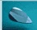

## Sprzedawca

Nazwa firmy

adres ulica

00-950 Warszawa

NIP: 55513662256668978

Tel.: +45 123 123 123

Fax: +48 518 702 002

www.www.firma.pl

KRS: Krs 123

E-mail: adres@asdf.pl

Nr konta - 59 2480 0002 2201 XXXX 6181 XXXX

Nr SWIFT/BIC: BPKOPLPW

## Nabywca

Kontrahent pojedynczy

Markowa 45

NIP: 123412344234

Tel.: 34 123412341234

Fax: undefined fax

E-mail: test@pragse.pl

Nr konta - 84 2490 0005 0001 XXXX 9889 XXXX

Super Bank - 1234 1234 1234 1234 1243 Nr konta VAT: 2345 2345 2345 2345 2345 Nr SWIFT/BIC: swlift

## EUR

<table border=1 style='margin: auto; width: max-content;'><tr><td style='text-align: center;'>Zdjęcie</td><td style='text-align: center;'>Nazwa towaru/usługi</td><td style='text-align: center;'>Status produktu</td><td style='text-align: center;'>Typ GTU</td><td style='text-align: center;'>Ilość</td><td style='text-align: center;'>Jm</td><td style='text-align: center;'>Cena netto</td><td style='text-align: center;'>VAT</td><td style='text-align: center;'>Kwota netto</td><td style='text-align: center;'>Kwota VAT</td><td style='text-align: center;'>Kwota brutto</td></tr><tr><td style='text-align: center;'></td><td style='text-align: center;'>rynna dachowa 125 - Bryza</td><td style='text-align: center;'></td><td style='text-align: center;'>GTU_05</td><td style='text-align: center;'>1.0</td><td style='text-align: center;'>ddd</td><td style='text-align: center;'>105.69</td><td style='text-align: center;'>23%</td><td style='text-align: center;'>105.69</td><td style='text-align: center;'>24.31</td><td style='text-align: center;'>130.00</td></tr><tr><td style='text-align: center;'></td><td style='text-align: center;'>Kostka - super producent</td><td style='text-align: center;'></td><td style='text-align: center;'></td><td style='text-align: center;'>1.0</td><td style='text-align: center;'>ddd</td><td style='text-align: center;'>100.00</td><td style='text-align: center;'>8%</td><td style='text-align: center;'>100.00</td><td style='text-align: center;'>8.00</td><td style='text-align: center;'>108.00</td></tr></table>

Lacznie 2.0

SUMA: 238.00

## Dane do przelewu:

Wplacono

Data wplaty

2023-07-10

Kwota wplaty

100.00 PLN

Sposób wpłaty akredytywa

<table border=1 style='margin: auto; width: max-content;'><tr><td style='text-align: center;'>Stawka VAT</td><td style='text-align: center;'>Netto</td><td style='text-align: center;'>VAT</td><td style='text-align: center;'>Brutto</td></tr><tr><td style='text-align: center;'>23%</td><td style='text-align: center;'>105.69</td><td style='text-align: center;'>24.31</td><td style='text-align: center;'>130.00</td></tr><tr><td style='text-align: center;'>8%</td><td style='text-align: center;'>100.00</td><td style='text-align: center;'>8.00</td><td style='text-align: center;'>108.00</td></tr><tr><td style='text-align: center;'>Razem</td><td style='text-align: center;'>205.69</td><td style='text-align: center;'>32.31</td><td style='text-align: center;'>238.00</td></tr></table>

Sposób wpłaty: akredytywa

Termin zapłaty: 2023-07-18

Iłość: 2.00

Zaplać online

Osoba upoważniona do odbioru

### Razem do zaplaty: 238.00 PLN

Włacono: 100.00 PLN

Pozostalo do zapłaty: 138.00 PLN

Kwota słownie: dwieście trzydzieści osiem PLN 00/100

Osoba upoważniona do wystawienia